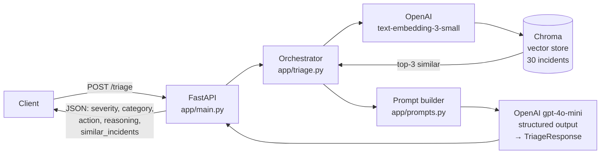

# Incident Triage Agent

A RAG-based FastAPI service that suggests triage actions severity, category, recommended next step for incoming incident reports by retrieving similar past incidents and prompting an LLM with the retrieved context.

> **Status:** v1, in active development. Built April 26 – May 3, 2026.

## Why this exists

Incident triage — deciding how severe an incident is, which team owns it, and what the first response should be is one of the most time-sensitive steps in an SRE / on-call workflow. Junior responders typically spend 5–15 minutes searching past incidents, runbooks, and Slack to figure out "have we seen this before?" This project automates that lookup: feed in an incident description, get back a suggested severity, category, and recommended action grounded in similar past incidents with the source incident IDs returned so the on-call can verify the grounding before acting.

## Architecture



Single Python process. Chroma persists embeddings to local disk. The same Pydantic `TriageResponse` model defines the API contract *and* constrains the LLM's output single source of truth, no schema drift.

## Stack

- **API:** Python 3.10+, FastAPI, Pydantic
- **Embeddings:** OpenAI `text-embedding-3-small` (1536 dimensions)
- **Vector store:** Chroma, local persistent client
- **LLM:** OpenAI `gpt-4o-mini` with structured output mode
- **Corpus:** 30 synthetic incidents covering outage, security, performance, data integrity, and deployment failure categories

## Design decisions

**1. Pydantic schema as source of truth for both the API and the LLM.**
The `TriageResponse` model (in `app/schemas.py`) does three jobs at once: validates the FastAPI response, generates the OpenAPI/Swagger docs, and constrains the LLM via OpenAI's structured-output mode (`client.beta.chat.completions.parse(response_format=TriageResponse, ...)`). Adding or changing a field updates all three behaviours from one edit. The alternative separate JSON schemas for the API and the LLM — is two sources of truth and inevitably drifts.

**2. Embed `title + description + resolution`, not just description.**
Resolution text is the single strongest similarity signal for triaging a new incident  past *fixes* tell you what kind of incident the new one really is more reliably than past *symptoms*. Embedding all three concatenated outperformed description-only on the eval queries.

**3. Constrained category and severity values via `Literal[...]` typing.**
`severity` is `Literal["P1", "P2", "P3", "P4"]` and `category` is one of five predefined strings. Three benefits: downstream consumers (PagerDuty, dashboards) get predictable values, the LLM's structured output cannot return free-form garbage, and the system prompt's severity/category definitions act as a controlled vocabulary the model can ground in.

**4. Chroma local persistent client over a hosted vector DB.**
Chroma runs in-process and persists to a `./chroma_db/` directory. Zero infra to deploy, zero credentials to manage, fast first-request, fully reproducible from a single seed script. The trade-off is no cross-instance sharing for a single-process demo this is the right call; for a multi-instance production deploy you'd swap to Pinecone, Weaviate, or Postgres + pgvector.

## API

### `POST /triage`

**Request:**
```json
{
  "description": "Our Stripe webhook integration started returning 502 errors about 15 minutes ago. Roughly 40% of incoming webhooks failing. Customers reporting that payment confirmations are delayed."
}
```

**Response (200):**
```json
{
  "severity": "P1",
  "category": "outage",
  "recommended_action": "Investigate the health of the Stripe webhook service and check for any upstream issues. Restart the service if necessary to restore functionality.",
  "reasoning": "The new incident involves a significant outage with 40% of incoming webhooks failing, which aligns with the pattern of the previous incidents, particularly INC-002 where a surge of 5xx errors was resolved by addressing a failing pod. The customer-facing impact on payment confirmations indicates revenue-impacting severity, thus categorizing it as P1.",
  "similar_incidents": ["INC-002"]
}
```

The response includes `similar_incidents` the corpus IDs that informed the triage so the on-call can audit the grounding before acting.

### Other endpoints
- `GET /` - service identity
- `GET /health` - liveness probe
- `GET /docs` - interactive Swagger UI (auto-generated by FastAPI)

## Run locally

Requires Python 3.10+ and an OpenAI API key.

```bash
git clone https://github.com/praveen098/incident-triage-agent.git
cd incident-triage-agent

python3.10 -m venv .venv
source .venv/bin/activate
pip install -r requirements.txt

# Configure your API key
echo 'OPENAI_API_KEY=sk-your-key-here' > .env

# Seed the corpus into the vector store (one-time, ~$0.0001 in API spend)
python -m scripts.seed_corpus

# Start the API
uvicorn app.main:app

# In a separate terminal — try a request
curl -X POST http://localhost:8000/triage \
  -H "Content-Type: application/json" \
  -d '{"description": "Login broken for everyone."}'
```

The `/docs` Swagger UI at `http://localhost:8000/docs` is the easiest way to explore the API.

## Evaluation

A small manual eval harness in `scripts/run_test_queries.py` runs 8 curated test queries covering all five categories plus three edge cases (no good corpus match, very short input, ambiguous classification). Run it against a live local server:

```bash
uvicorn app.main:app  # in one terminal
python -m scripts.run_test_queries  # in another
```

It prints a summary table and writes full responses to `test_outputs.json` for inspection.

Latest results: **8/8 on category accuracy, 6/8 on intuitive severity calibration**, with one documented regression (see Limitations).

## Limitations

This is a v1 built in 7 days as a side project, not a production system. Honest scope:

- **No formal eval harness.** The 8 test queries are eyeballed for correctness no consistency checks across runs, no scoring rubric, no held-out test set. The next obvious step would be deterministic scoring against expected outputs and tracking metrics across prompt iterations.
- **One known regression.** After tuning the system prompt to improve P1 calibration on revenue-impacting cases, one test query (`deployment_failure`) drifted from `P1/deployment_failure` to `P1/outage`. The model now over-weights "5xx for users" as an outage signal even when the cause is a deploy. I chose to document the trade-off rather than chase it — prompt iteration without metrics is a yak-shave, and chasing one regression usually creates another.
- **Synthetic corpus.** All 30 incidents in `data/incidents.json` are hand-written examples. Real-world performance depends on the quality and distribution of the actual incident history a team would have.
- **Single process.** Chroma persists to local disk; not designed for multi-instance deploys. For production, swap the vector store layer.
- **No retry logic beyond the OpenAI SDK's defaults.** The SDK retries transient failures automatically (2 retries, exponential backoff). I haven't added a circuit breaker, fallback model, or response caching all reasonable next additions for a production deployment.
- **Prompt is not versioned.** A real iteration cycle would A/B prompts against the eval set and track deltas; for v1 I locked the prompt after one round of tuning.

## What's in the repo

```
incident-triage-agent/
├── app/
│   ├── __init__.py
│   ├── main.py              # FastAPI app + route handlers
│   ├── schemas.py           # Pydantic models — API contract + LLM constraint
│   ├── triage.py            # Orchestration: retrieve → prompt → LLM
│   ├── vector_store.py      # OpenAI embeddings + Chroma persistence
│   ├── llm.py               # OpenAI structured-output wrapper
│   └── prompts.py           # System prompt + user prompt builder
├── scripts/
│   ├── seed_corpus.py       # One-time corpus → embeddings → Chroma
│   ├── test_retrieval.py    # Manual smoke test for retrieval only
│   └── run_test_queries.py  # 8-query eval harness against the live API
├── data/
│   └── incidents.json       # 30 synthetic incidents
├── test_outputs.json        # Latest eval-harness output
├── README.md
└── requirements.txt
```

## Author

Praveen Sharma — [github.com/praveen098](https://github.com/praveen098)